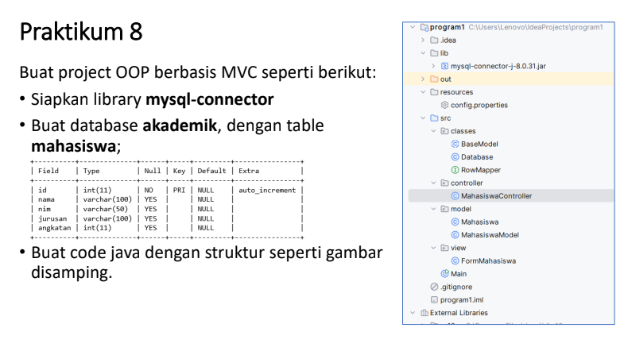
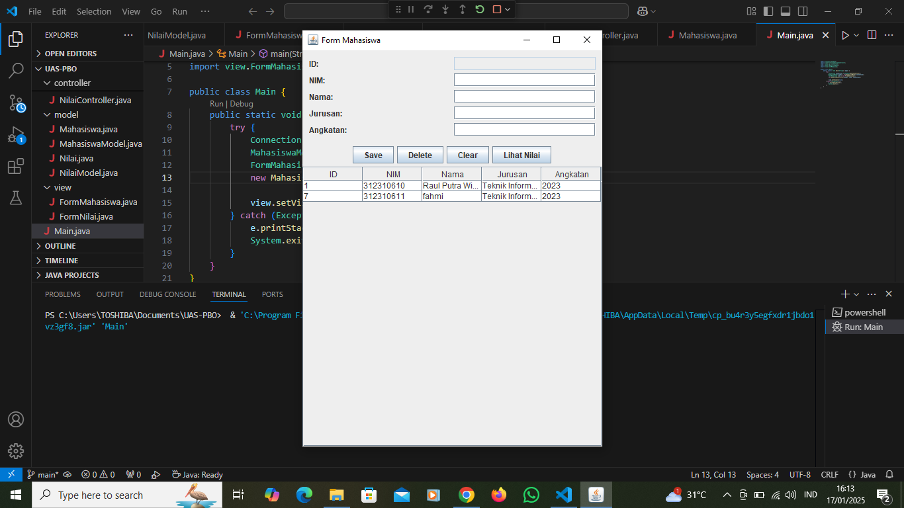
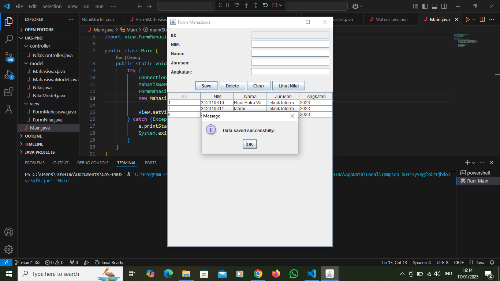
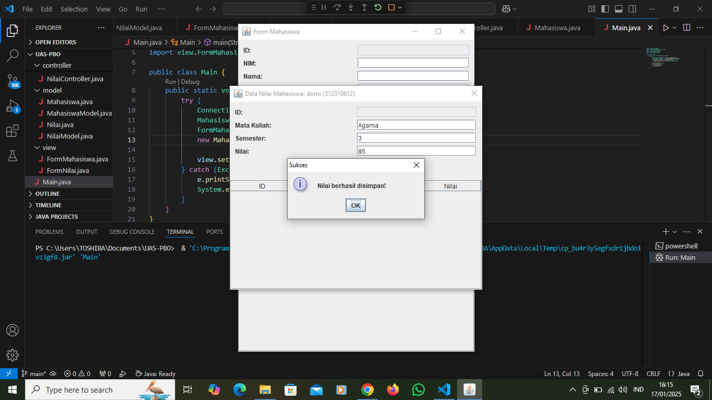
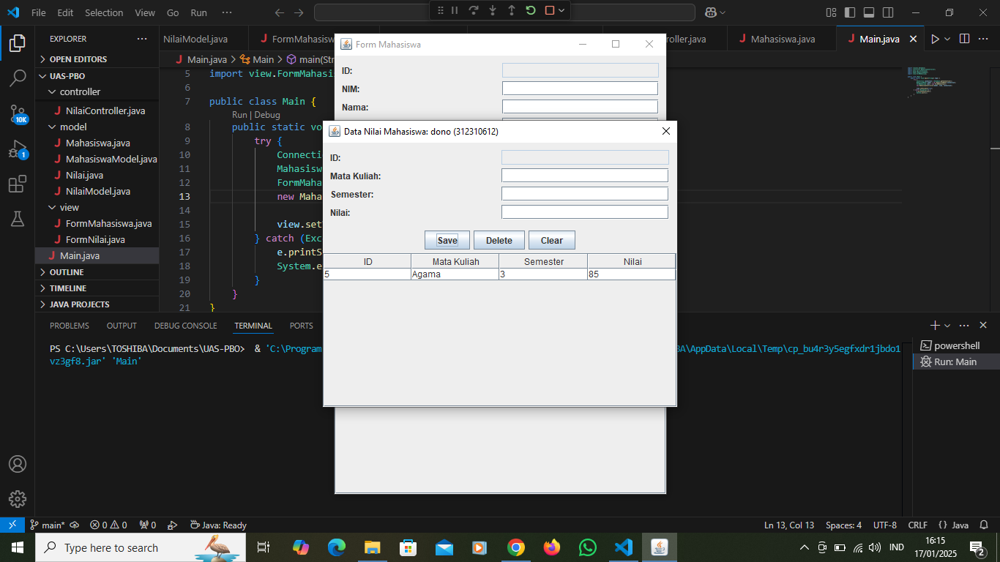
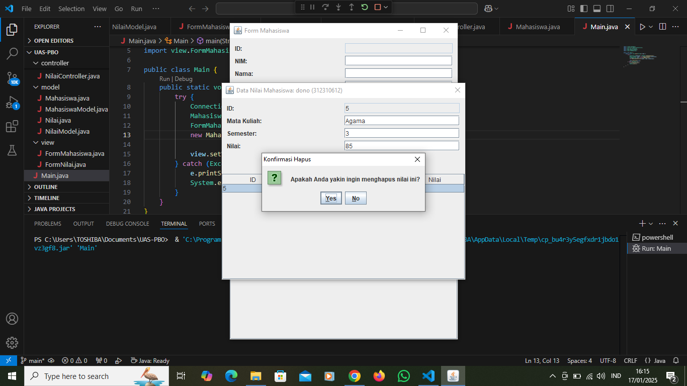
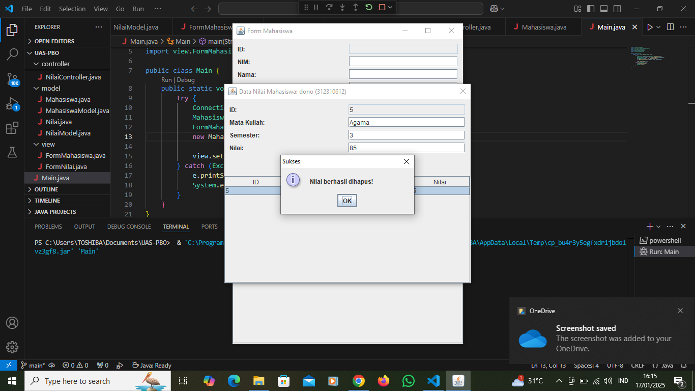

# OOP Berbasis MVC
## Link-Penjelasan-Youtube
https://youtu.be/UbAm56ecZV0

  

| Variable           |             Isi            |
| -------------------|----------------------------|
| **Nama**           |     Raul Putra Widodo    |
| **NIM**            |          312310610         |
| **Kelas**          |          TI.23.A.6         |
| **Mata Kuliah**    | Pemrograman Orientasi Objek|
| **Dosen Pengampu** |Agung Nugroho S.kom., M.Kom.|

  

# Tugas UAS Pemrograman Orientasi Objek

# Tampilan Awal Setelah Program Di Jalankan

# Tampilan Setelah Menambah Data Mahasiswa

# Tampilan Awal Jika Ingin Menambah Nilai Mahasiswa

# Tampilan Setelah Berhasil Menambah Nilai Mahasiswa

# Tampilan Setelah Menambah Nilai Mahasiswa

# Tampilan Jika Ingin Menghapus Nilai Mahasiswa

# Tampilan Setelah Berhasil Menghapus Nilai Mahasiswa

# Tampilan Setelah Berhasil Menghapus Data Mahasiswa

